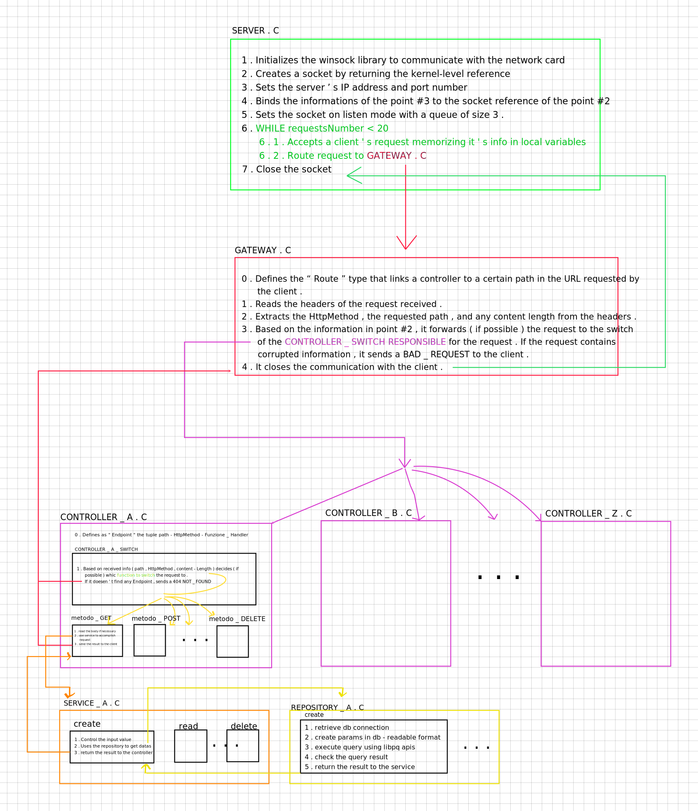

# PURE C SERVER

The purpose of this project is to create a RESTFul server in pure C.
All choices have been made so that you can learn how a server works behind the scenes and without
the help of any framework.

## How it works

